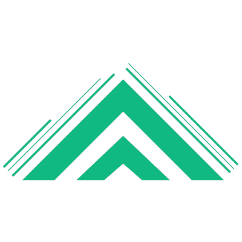

# Mandrothain

## Built With

* Next.js
    * Server Side Rendering
    * Incremental Static Regeneration
    * Next Components (Link, Image, etc)
* Tailwind CSS
    * Built In & Custom classes
    * Toggleable dark/light theme
* Redux

## Working On

* Axios
    * Twitch API
    * YouTube API
    * Twitter API
* Firebase
    * User Login
    * Comments
    * Forums
* Sanity CMS
    * Update schedule
    * Updates to channels

## Distant Future

* Stripe
    * Payments

# About This Website

I am working on building a following on Twitch, YouTube and Twitter, and I thought that building this website would be a
great way to have a hub for my followers to visit to catch up on my content.

Right now I am implementing the Twitch, YouTube and Twitter APIs to show the following.

#### TWITCH

* Live feed
* Follow count
* Chat

#### Youtube

* All videos and relevant information
    * Likes (and dislikes if possible)
    * View count
* Highlight latest video
* Subscriber count

#### Twitter

* Follower count
* Most recent tweets

#### Sanity CMS

* Update schedules (if I want to have a schedule in the future)
* Give updates on streams and videos.

#### Stripe

* Payments as an alternative to Superchats or Twitch Subscriptions etc.
    * This will be something I worry about in the future if I reach a point where I can make money doing this.
        * This website is primarily to have a hub and not a payment gateway, but down the road could be a good option so
          it is in the back of my mind. This section is mostly a reminder to me.

## The Design

Because this is a website for video game content, and RGB lighting is popular with PC gamers and streamers, I wanted to
give the main components a glow that is around the same color as my logo (which is Tailwind's Emerald-500). I also
wanted to experiment with pnuemorphic design, and allow the user to toggle between a light and dark mode.

One difficulty with pneumorphic design is readability and SEO. By its nature, this design style will take a hit to SEO,
since elements are all the same color and only seperated by shadows that appear to glow, but I have tried to soften the
blow by adding a slight border around each component. 
